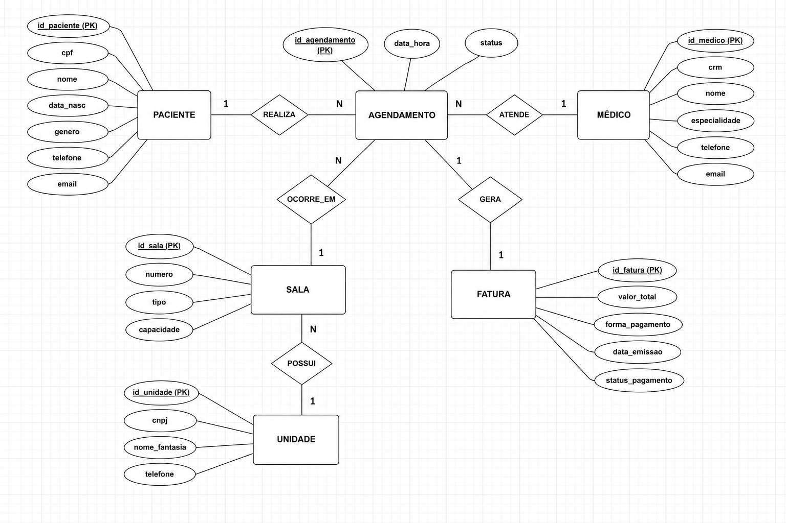
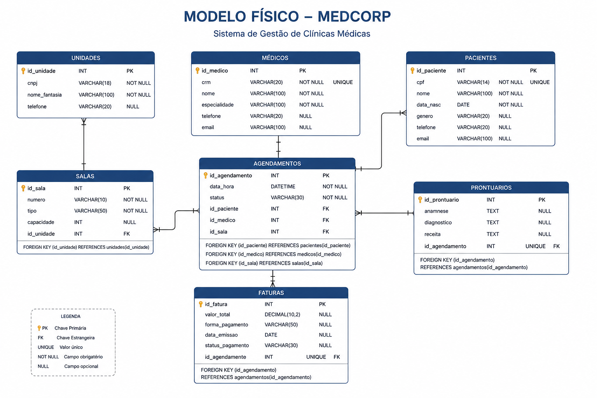

# Trabalho-BD1-P2
# MedCorp - Sistema de Gestão de Clínicas Médicas

## Sobre o Projeto

Este projeto foi desenvolvido para a disciplina de Banco de Dados I do CEFET-RJ.

O objetivo foi modelar e implementar um banco de dados para uma rede de clínicas médicas chamada **MedCorp**, permitindo o gerenciamento de pacientes, médicos, agendamentos, prontuários e faturamento.

---

## Objetivos

- Gerenciar pacientes
- Controlar médicos e especialidades
- Organizar agendamentos
- Registrar prontuários
- Gerenciar faturamento
- Garantir integridade dos dados

---

## Modelo Conceitual

---

## Entidades Principais

### Paciente
- CPF
- Nome
- Data de nascimento
- Gênero
- Telefone
- E-mail

### Médico
- CRM
- Nome
- Especialidade
- Telefone
- E-mail

### Agendamento
- Data
- Hora
- Status

### Sala
- Número
- Tipo
- Capacidade

### Unidade
- CNPJ
- Nome Fantasia
- Telefone

### Fatura
- Valor Total
- Forma de Pagamento
- Data de Emissão

---

## Relacionamentos

- Um paciente pode realizar vários agendamentos.
- Um médico pode atender vários pacientes.
- Uma unidade possui diversas salas.
- Uma sala pode receber diversos agendamentos.
- Cada agendamento gera uma única fatura.

---

## Modelo Físico

Tabelas implementadas:

---

## Tecnologias Utilizadas

- SQL
- MySQL
- Draw.io
- GitHub

---

## Autor

Renan Brilhante

CEFET-RJ - Sistemas de Informação

Disciplina: Banco de Dados I

Professor: Rafael Costa
